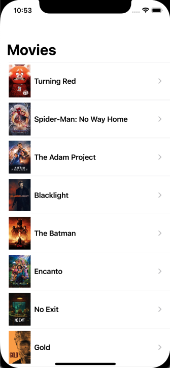

# Popular Movies (SwiftUI)

A new approach of Popular Movies project from [Udacity's Android Developer Nanodegree](https://www.udacity.com/course/android-developer-nanodegree-by-google--nd801) that uses [TMDB API](https://developers.themoviedb.org/3/getting-started/introduction).

I know that a lot of people might be thinking that I really enjoy this project/API because I'm always using it as a playground 😅, but the point is that the API itself doesn't matter at all and I always try to focus on new concepts and architectures that need to consume an API without wasting time discovering new endpoints, handling new payloads, etc.


With the disclaimer done, this version uses the power of SwiftUI to quickly build a "master -> detail" UI that automatically reacts and gets updated with data fetched from an API.

That's amazing how small this app became (just 6 files with about 30 lines on average) with those mentioned features. Of course that a lot of things can be improved, for example, the repository in this project is a plain singleton that fetches data without handling any errors and is directly consumed by the image view, so a clean approach with [VIPER](https://www.raywenderlich.com/8440907-getting-started-with-the-viper-architecture-pattern) might be a way to go.

## Run App

API key must be added on a new file: `/PopularMoviesSwiftUI/Secrets.xcconfig`

```
  movies_api_key = xxxxxxxxxxxxxxxxxx
```

You can grab an API key for free [here](https://developers.themoviedb.org/3/getting-started/introduction)

## Screenshots

<table align="center">
  <tr>
     <td>
       
     </td>
     <td>
       
     </td>
  </tr>
</table>


## Copyright

Project developed by Márcio Souza de Oliveira.
